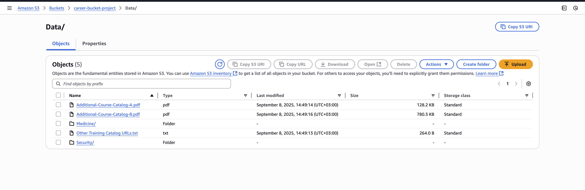

# Rubric


## Create and Customize Amazon Q Application


## Upload Static PDF and Connect Amazon S3





### Missing Screenshots, second submission


## Secure the Application

The acl contents 
```json
[
    {
        "keyPrefix": "s3://career-bucket-project/Data/Medicine/",
        "aclEntries": [
            {
                "Name": "career.coach.one",
                "Type": "GROUP",
                "Access": "ALLOW"
            }
        ]
    },
        {
        "keyPrefix": "s3://career-bucket-project/Data/",
        "aclEntries": [
            {
                "Name": "career.coach.two",
                "Type": "GROUP",
                "Access": "DENY"
            }
        ]
    }
]

```

This run is by coach.one


Coach.two is blocked from the resources, so the fallback works and q app uses the general knowledge. This confirms that the acl policy works. 


The blocked words.


## Publish and Share the Application

From this single screenshot, you can see that the app is shared as it is in the apps directory, I have added some custom tags and tag the app. Also verified the app. 


